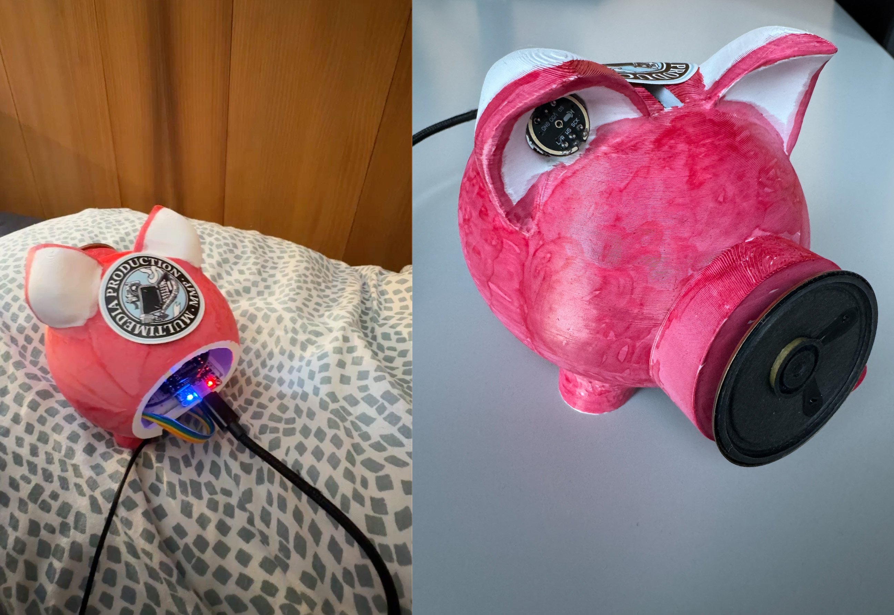
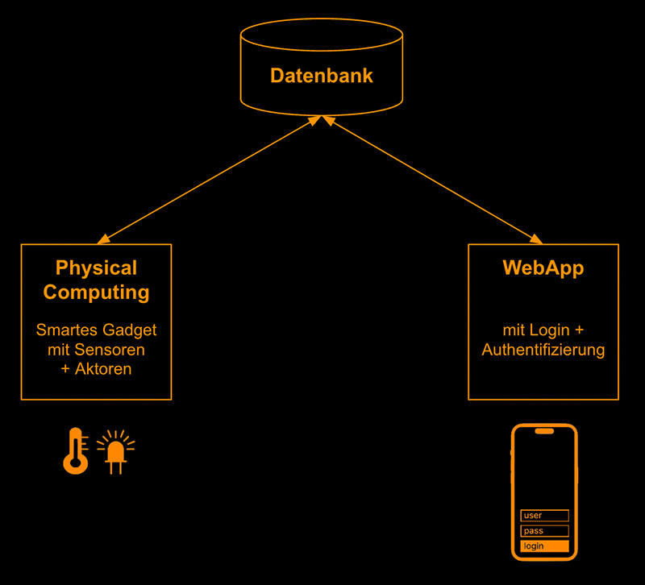
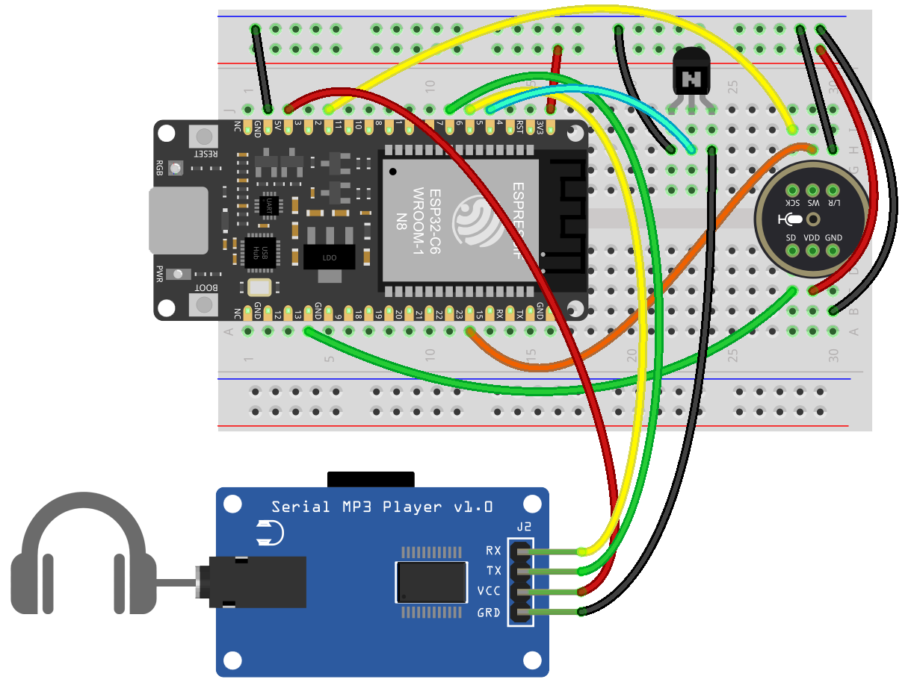
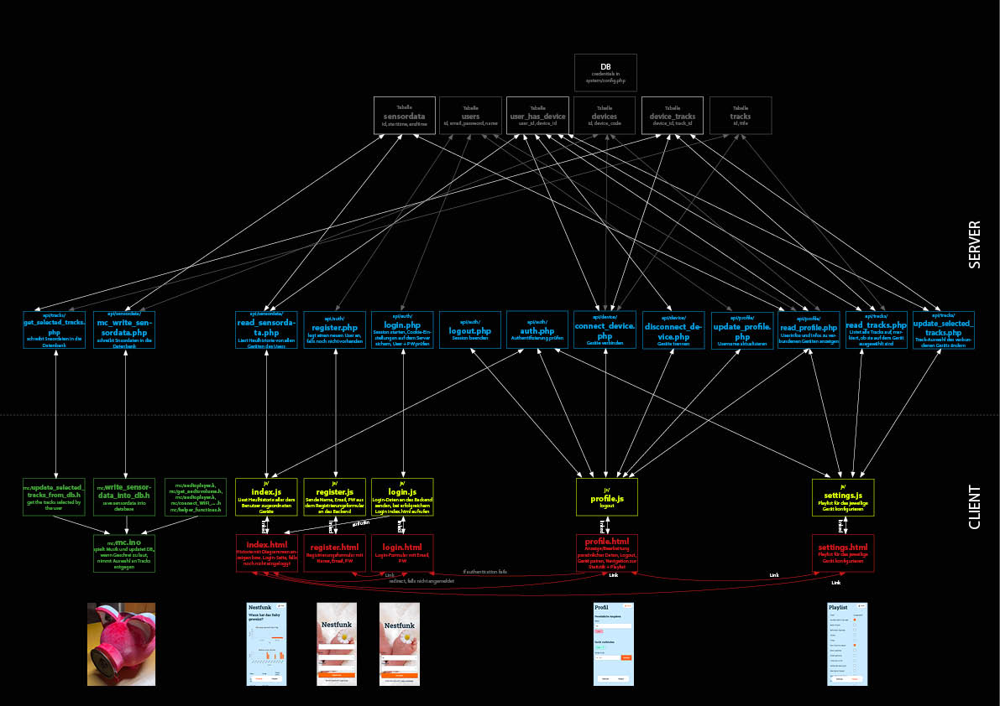

# Nestfunk - Die IoT Babyphone Applikation



Dieses Repository umfasst eine ganzheitliche IoT-Lösung, bestehend aus einem **smarten Gadget (1)** und einer **Web-App (2)** mit Login und Authentifizierung. Das System erkennt das Weinen eines Babys, reagiert autonom mit beruhigender Musik und visualisiert die Daten für die Eltern in einem Dashboard.
Zusätzlich können die Eltern die abzuspielende Musik auswählen.
[Demo und Erklärung auf Youtube](https://youtu.be/Q8TB_PKfyzY)



---

## 1. Smart Gadget (Physical Computing)


Das Gadget ist das "Ohr" des Systems. Ein ESP32-Mikrocontroller analysiert Geräusche und steuert die Hardware-Komponenten.

### 1.1 Architektur & Datenfluss

Der Mikrocontroller fungiert als Brücke zwischen der physischen Welt und der Datenbank. Die logischen Beziehungen der Dateien und der Datenfluss zum Backend sind im zentralen Schaubild dargestellt:

**Der Prozess:**

1.  **Messen:** Das Mikrofon misst permanent den Schalldruckpegel.
2.  **Trigger:** Bei Überschreitung eines Schwellenwerts startet der MP3-Player.
3.  **Senden:** Der ESP32 sendet via HTTP-POST (an `api/load.php`) den Startzeitpunkt an das Backend.
4.  **Abschluss:** Sobald der Pegel wieder sinkt, wird der Endzeitpunkt gesendet.

### 1.2 Projektstruktur (Ordner `/mc`)

Grundsätzlich hätte der gesamte Code für den ESP32(-C6) in die `mc/mc.ino` geschrieben werden können. Um den Code allerdings übersichtlich zu halten, ist die Logik in Header-Dateien (`.h`) ausgelagert. Diese enthalten thematisch abgegrenzten Code, damit die Hauptdatei (`.ino`) schlanker und logisch einfacher zu erfassen ist.

| Datei                      | Rolle                                                                                                                                                                                                                                      |
| :------------------------- | :----------------------------------------------------------------------------------------------------------------------------------------------------------------------------------------------------------------------------------------- |
| `mc.ino`                   | **Main:** Das Hauptprogramm, welches Setup und Loop koordiniert. Alle langen Code-Passagen sind in die Header-Dateien (.h) ausgelagert.                                                                                                    |
| `connectWiFi_zuhause.h`    | Herstellung der WLAN Verbindung mit einem Heimnetzwerk (mit SSID und Passwort). Wenn zB. mit einem einfachen Heimnetzwerk verbunden werden soll, wird dieses Script in das Hauptscript `mc.ino` eingebunden.                               |
| `password_zuhause.h`       | Hier befinden sich die Zugangsdaten für ein gewöhnliches Heimnetzwerk. Diese Datei wird in `connectWiFi_zuhause.h` eingebunden. Sie ist geheim und muss in `.gitignore` aufgenommen werden                                                 |
| `connectWiFi_hochschule.h` | Herstellung der WLAN Verbindung mit einem WPA2-Enterprise-verschlüsselten Netzwerk. Wenn zB. mit dem Hochschulnetzwerk verbunden werden soll, wird dieses Script in das Hauptscript `mc.ino` eingebunden.                                  |
| `password_hochschule.h`    | Hier befinden sich die Zugangsdaten für das WPA2-Enterprise-verschlüsselte Netzwerk, zB. eduroam an der Hochschule. Diese Datei wird in `connectWiFi_hochschule.h` eingebunden. Sie ist geheim und muss in `.gitignore` aufgenommen werden |
| `get_audiovolume.h`        | Schallpegel (dB) messen. Diese Datei wird in `mc.ino` eingebunden.                                                                                                                                                                         |
| `audioplayer.h`            | Audio player functionality. Diese Datei wird in `mc.ino` eingebunden.                                                                                                                                                                      |

### 1.3 Entwicklungsschritte (Step-by-Step)

1.  **User Flow:** Erstellung des logischen Ablaufs .
2.  **Audio-Check:** Ansteuerung des Players über RX/TX. Songs (MP3) liegen in Ordnern `01`, `02` etc. auf der SD-Karte.
3.  **Manuelle Steuerung:** Player-Test mit einem einfachen Taster.
4.  **Sensor-Test:** Taster als Trigger ersetzen: Mikrofon einpegeln und Schwellenwerte für "Weinen" definieren.
5.  **Automatisierung:** Ersatz des physischen Tasters durch den Mikrofon-Pegel als Trigger.
6.  **Cloud-Schnittstelle:** Senden der Daten per HTTP POST an das PHP-Script.
7.  **Gehäuse:** Design in z.B. Fusion 360 und Druck mit einem Bambulab x1c 3D-Drucker.

### 1.4 Usage (Manual to Reproduce)

1.  **Hardware:** Schaltung gemäss `Steckplan.png` aufbauen. 
2.  **IDE:** `mc/mc.ino` in der Arduino IDE öffnen.
3.  **Setup:** ESP32-Board und erforderliche Libraries auf dem Computer installieren.
4.  **Config:** WLAN-Informationen und DB-Details in der `mc.ino` (bzw. `config.h`) anpassen.
5.  **Upload:** Code auf den ESP32 laden.

---

## 2. Web-App & Backend


Die Web-App dient als Interface für die Eltern, um Statistiken einzusehen und das Gerät (z.B. die Playlist) zu konfigurieren.

#### Architektur-Überblick

Die App basiert auf einer strikten Trennung von Frontend (Browser) und Backend (Server):


Dieses Repository ist ein Beispielprojekt für Interaktive Medien IV. **Heulradar** ist eine Web-App, mit der Eltern ihr Babyphone verwalten, eine Playlist konfigurieren und die Statistik einsehen können, wann ihr Baby geweint hat.

Die App dient gleichzeitig als **Lernprojekt**, um die folgenden Konzepte zu verstehen:

- Wie **Authentication** (Login / Registrierung / Session) funktioniert
- Warum man **Frontend und Backend trennt** (API-basierter Ansatz)
- Wie eine **REST-ähnliche API** mit PHP aufgebaut wird

---

1. [Architektur-Überblick](#1-architektur-überblick)
2. [Warum Frontend und Backend trennen?](#2-warum-frontend-und-backend-trennen)
3. [Authentication (Login-System) erklärt](#3-authentication-login-system-erklärt)
4. [Projektstruktur](#4-projektstruktur)
5. [Datenbank-Schema](#5-datenbank-schema)
6. [API-Referenz](#6-api-referenz)
7. [Frontend: Wie die Seiten funktionieren](#7-frontend-wie-die-seiten-funktionieren)
8. [Installation](#8-installation)
9. [Troubleshooting](#9-troubleshooting)

---

### 2.1 Architektur-Überblick

Die App besteht aus zwei klar getrennten Teilen:

```
┌─────────────────────────────┐       HTTP (fetch)       ┌──────────────────────────────┐
│         FRONTEND            │ ◄──────────────────────►  │          BACKEND             │
│                             │                           │                              │
│  HTML-Seiten (login.html,   │   GET / POST Requests     │  PHP-Dateien unter api/      │
│  index.html, settings.html) │   mit JSON als Antwort    │  Gibt JSON zurück            │
│                             │                           │                              │
│  JavaScript (login.js,      │                           │  Spricht mit der Datenbank   │
│  index.js, settings.js)     │                           │  (MySQL via PDO)             │
│                             │                           │                              │
│  CSS (design_system.css,    │                           │  Verwaltet Sessions          │
│  style.css, nav.css)        │                           │  (Authentication)            │
└─────────────────────────────┘                           └──────────────────────────────┘
```

**Das Prinzip:** Das Frontend (HTML/JS/CSS) läuft im Browser des Users. Wenn Daten gebraucht werden (z.B. "Zeige mir die Statistik, wann das Baby geweint hat"), schickt JavaScript einen `fetch()`-Request an eine PHP-Datei im `api/`-Ordner. Diese PHP-Datei holt die Daten aus der Datenbank und gibt sie als **JSON** zurück. JavaScript empfängt das JSON und rendert die Daten ins HTML.

---

### Authentication (Login-System)

### Der "alte" Weg: Alles in PHP

Früher hat man oft alles in einer einzigen PHP-Datei gemacht - HTML, Logik und Datenbankabfragen gemischt:

```php
<!-- ❌ So NICHT - alles vermischt -->
<?php
session_start();
$pdo = new PDO(...);
$stmt = $pdo->query("SELECT * FROM tracks");
$tracks = $stmt->fetchAll();
?>
<html>
<body>
  <table>
    <?php foreach ($tracks as $track): ?>
      <tr><td><?= $track['title'] ?></td></tr>
    <?php endforeach; ?>
  </table>
</body>
</html>
```

Das funktioniert zwar, hat aber Nachteile:

| Problem                    | Erklärung                                                                     |
| -------------------------- | ----------------------------------------------------------------------------- |
| **Unübersichtlich**        | HTML und PHP-Logik sind vermischt, schwer zu lesen                            |
| **Schwer wartbar**         | Änderungen am Design erfordern, dass man PHP-Code anfasst                     |
| **Nicht wiederverwendbar** | Die Daten sind an das HTML gebunden - eine Mobile-App könnte sie nicht nutzen |
| **Kein klarer Vertrag**    | Es gibt keine definierte Schnittstelle zwischen Frontend und Backend          |

### Der moderne Weg: API-basiert (wie in diesem Projekt)

```
Frontend (HTML + JS)  ──fetch()──►  Backend (PHP API)  ──SQL──►  Datenbank
                      ◄──JSON────
```

```javascript
// ✅ So machen wir es - klare Trennung
const response = await fetch("api/tracks/read.php");
const tracks = await response.json();

// Jetzt können wir die Daten beliebig darstellen
tracks.forEach((track) => {
  const row = document.createElement("tr");
  row.innerHTML = `<td>${track.title}</td>`;
  tbody.appendChild(row);
});
```

**Vorteile:**

| Vorteil                 | Erklärung                                                                                |
| ----------------------- | ---------------------------------------------------------------------------------------- |
| **Klare Trennung**      | Frontend kümmert sich um Darstellung, Backend um Daten & Logik                           |
| **Wiederverwendbar**    | Die gleiche API könnte von einer Mobile-App, einem anderen Frontend, etc. genutzt werden |
| **Einfacher zu testen** | Man kann die API unabhängig vom Frontend testen (z.B. mit Postman)                       |
| **Paralleles Arbeiten** | Ein Team arbeitet am Frontend, ein anderes am Backend                                    |
| **Industrie-Standard**  | So arbeiten professionelle Teams heute                                                   |

### Was ist JSON?

JSON (JavaScript Object Notation) ist das Standard-Datenformat für die Kommunikation zwischen Frontend und Backend:

```json
{
  "status": "success",
  "user_id": 42,
  "email": "anna@example.com"
}
```

Jede PHP-Datei im `api/`-Ordner setzt `header('Content-Type: application/json')` und gibt mit `json_encode()` ein JSON-Objekt zurück. Im JavaScript wird dieses mit `response.json()` geparst.

---

## 2.3. Authentication (Login-System) erklärt

Authentication (kurz "Auth") beantwortet die Frage: **"Wer bist du?"** - Es stellt sicher, dass nur registrierte Benutzer auf geschützte Seiten zugreifen können.

### 2.3.1 Die Grundidee: Sessions & Cookies

HTTP ist **zustandslos** (stateless) - der Server vergisst nach jedem Request, wer du bist. Damit er sich trotzdem "merken" kann, dass du eingeloggt bist, nutzen wir **Sessions**:

```
1. Du loggst dich ein (Email + Passwort)
2. Der Server erstellt eine Session (eine Art Gedächtnis) und speichert deine User-ID darin
3. Der Server schickt dir ein Session-Cookie (eine kleine ID) zurück
4. Bei jedem weiteren Request schickt dein Browser dieses Cookie automatisch mit
5. Der Server liest das Cookie, findet die Session, und weiss wieder wer du bist
```

```
Browser                              Server
  │                                     │
  │  POST /api/auth/login.php           │
  │  email=anna@test.ch&password=123    │
  │ ──────────────────────────────────► │
  │                                     │  ✓ Passwort stimmt!
  │                                     │  Session erstellen: { user_id: 42 }
  │  Set-Cookie: PHPSESSID=abc123       │
  │ ◄────────────────────────────────── │
  │                                     │
  │  GET /api/sensordata/read_sensordata.php      │
  │  Cookie: PHPSESSID=abc123           │  (Browser schickt Cookie automatisch)
  │ ──────────────────────────────────► │
  │                                     │  Session "abc123" → user_id: 42
  │                                     │  → Daten für User 42 laden
  │  [{ starttime: "...", ... }]        │
  │ ◄────────────────────────────────── │
```

### 2.3.2 Registrierung (Schritt für Schritt)

**Frontend:** `register.html` + `js/register.js`
**Backend:** `api/auth/register.php`

#### Was passiert, wenn jemand auf "Registrieren" klickt?

**1. JavaScript fängt das Formular ab:**

```javascript
// register.js
document
  .getElementById("registerForm")
  .addEventListener("submit", async (e) => {
    e.preventDefault(); // Verhindert normales Absenden (Seite würde neu laden)

    const name = document.getElementById("name").value.trim();
    const email = document.getElementById("email").value.trim();
    const password = document.getElementById("password").value.trim();

    const response = await fetch("api/auth/register.php", {
      method: "POST",
      headers: { "Content-Type": "application/x-www-form-urlencoded" },
      body: new URLSearchParams({ name, email, password }),
    });
    const result = await response.json();

    if (result.status === "success") {
      window.location.href = "login.html"; // Weiterleitung zum Login
    }
  });
```

**2. PHP empfängt die Daten und verarbeitet sie:**

```php
// api/auth/register.php
// 1. Email-Duplikat prüfen
$stmt = $pdo->prepare("SELECT id FROM users WHERE email = :email");
$stmt->execute([':email' => $email]);
if ($stmt->fetch()) {
    echo json_encode(["status" => "error", "message" => "Email is already in use"]);
    exit;
}

// 2. Passwort hashen (NIEMALS Klartext speichern!)
$hashedPassword = password_hash($password, PASSWORD_DEFAULT);

// 3. User in Datenbank einfügen
$insert = $pdo->prepare("INSERT INTO users (name, email, password) VALUES (:name, :email, :pass)");
$insert->execute([':name' => $name, ':email' => $email, ':pass' => $hashedPassword]);
```

#### Warum `password_hash()`?

Passwörter werden **niemals im Klartext** in der Datenbank gespeichert. `password_hash()` erstellt einen sogenannten **Hash** - eine Einweg-Verschlüsselung:

```
Eingabe:  "meinPasswort123"
Hash:     "$2y$10$Xk3c8r2jF..."  (ca. 60 Zeichen, nicht umkehrbar)
```

Selbst wenn jemand die Datenbank hackt, kann er die Passwörter nicht lesen. Beim Login wird `password_verify()` verwendet, um zu prüfen, ob das eingegebene Passwort zum Hash passt.

### 2.3.3 Login (Schritt für Schritt)

**Frontend:** `login.html` + `js/login.js`
**Backend:** `api/auth/login.php`

#### Was passiert beim Login?

**1. JavaScript sendet Email und Passwort:**

```javascript
// login.js
const response = await fetch("api/auth/login.php", {
  method: "POST",
  headers: { "Content-Type": "application/x-www-form-urlencoded" },
  body: new URLSearchParams({ email, password }),
});
```

**2. PHP prüft die Credentials:**

```php
// api/auth/login.php
// 1. User in DB suchen
$stmt = $pdo->prepare("SELECT id, password FROM users WHERE email = :email");
$stmt->execute([':email' => $email]);
$user = $stmt->fetch(PDO::FETCH_ASSOC);

// 2. Passwort verifizieren
if ($user && password_verify($password, $user['password'])) {
    // 3. Session starten und User-Daten speichern
    session_regenerate_id(true);          // Neue Session-ID (Sicherheit)
    $_SESSION['user_id'] = $user['id'];   // User-ID merken
    $_SESSION['email'] = $email;          // Email merken

    echo json_encode(["status" => "success"]);
} else {
    echo json_encode(["status" => "error", "message" => "Invalid credentials"]);
}
```

#### Warum `session_regenerate_id(true)`?

Dies schützt vor **Session Fixation Attacks**. Nach dem Login bekommt der User eine neue Session-ID, damit ein Angreifer nicht eine alte, bekannte Session-ID ausnutzen kann.

### 2.3.4 Auth-Check: Geschützte Seiten absichern

Jede geschützte Seite (index.html, settings.html, profile.html) prüft beim Laden, ob der User eingeloggt ist:

**Frontend (wird auf jeder geschützten Seite aufgerufen):**

```javascript
// Diese Funktion steht in index.js, settings.js und profile.js
async function checkAuth() {
  const response = await fetch("api/auth/auth.php", {
    credentials: "include", // Cookie mitsenden!
  });

  if (response.status === 401) {
    window.location.href = "login.html"; // Nicht eingeloggt → Redirect
    return false;
  }

  const result = await response.json();
  if (result.error || !result.email) {
    window.location.href = "login.html";
    return false;
  }
  return true;
}
```

**Backend (`api/auth/auth.php`):**

```php
session_start();

if (!isset($_SESSION['user_id'])) {
    http_response_code(401);
    echo json_encode(["error" => "Unauthorized"]);
    exit;
}

echo json_encode([
    "email" => $_SESSION['email'],
    "user_id" => $_SESSION['user_id']
]);
```

**Der Ablauf:**

```
User öffnet index.html
  └─► JavaScript ruft checkAuth() auf
       └─► fetch("api/auth/auth.php") mit Session-Cookie
            └─► PHP prüft: Gibt es user_id in der Session?
                 ├─► JA  → 200 OK + User-Daten als JSON → Seite wird geladen
                 └─► NEIN → 401 Unauthorized → JavaScript leitet zu login.html weiter
```

### 2.3.5 Logout

Beim Logout wird die Session serverseitig zerstört:

**Frontend (`profile.js`):**

```javascript
async function logout() {
  await fetch("api/auth/logout.php");
  window.location.href = "login.html";
}
```

**Backend (`api/auth/logout.php`):**

```php
session_start();
$_SESSION = [];       // Alle Session-Daten löschen
session_destroy();    // Session komplett zerstören
```

### 2.3.6 Zusammenfassung Auth-Flow

```
                    ┌──────────────┐
                    │  register.   │
                    │  html        │
                    └──────┬───────┘
                           │ POST name, email, password
                           ▼
                    ┌──────────────┐
                    │  register.   │──► password_hash() ──► INSERT INTO users
                    │  php         │
                    └──────┬───────┘
                           │ Erfolg → Redirect
                           ▼
                    ┌──────────────┐
                    │  login.      │
                    │  html        │
                    └──────┬───────┘
                           │ POST email, password
                           ▼
                    ┌──────────────┐
                    │  login.      │──► password_verify() ──► Session setzen
                    │  php         │
                    └──────┬───────┘
                           │ Erfolg → Redirect
                           ▼
              ┌────────────────────────────┐
              │  Geschützte Seiten         │
              │  (index, settings, profile)│
              │                            │
              │  checkAuth() bei jedem     │
              │  Seitenaufruf              │
              └────────────┬───────────────┘
                           │ Logout
                           ▼
                    ┌──────────────┐
                    │  logout.php  │──► session_destroy()
                    └──────────────┘
```

---

## 2.4. Projektstruktur

```
heulradar/
│
├── index.html              ← Hauptseite: Sensordata - wann hat das baby geweint? (Charts + Tabelle)
├── login.html              ← Login-Formular
├── register.html           ← Registrierungs-Formular
├── settings.html           ← Playlist-Verwaltung
├── profile.html            ← Profil, Geräte verbinden, Logout
│
├── js/
│   ├── login.js            ← Login-Formular absenden
│   ├── register.js         ← Registrierung absenden
│   ├── index.js            ← Sensordata laden (wann das Baby geweint hat), Charts rendern
│   ├── settings.js         ← Tracks laden, Auswahl toggeln
│   └── profile.js          ← Profil laden, Geräte verwalten, Logout
│
├── css/
│   ├── design_system.css   ← Design Tokens (Farben, Schriften, Abstände)
│   ├── style.css           ← Hauptstyles (Layout, Typografie, Charts)
│   ├── nav.css             ← Bottom-Navigation & Profil-Shortcut
│   ├── login_register.css  ← Styles für Login/Register-Seiten
│   ├── profile.css         ← Styles für Profil-Seite
│   └── scoreboard.css      ← Tabellen-Styles
│
├── api/                    ← ⭐ Alle Backend-Endpoints (geben JSON zurück)
│   ├── auth/
│   │   ├── auth.php        ← Session prüfen ("Bin ich eingeloggt?")
│   │   ├── login.php       ← Login verarbeiten
│   │   ├── register.php    ← Registrierung verarbeiten
│   │   └── logout.php      ← Session zerstören
│   ├── device/
│   │   ├── connect_device.php     ← Gerät mit Code verbinden
│   │   ├── disconnect_device.php  ← Gerät trennen
│   │   └── list_devices.php        ← Geräte des Users auflisten
│   ├── profile/
│   │   ├── read_profile.php        ← Profildaten laden
│   │   └── update_profile.php      ← Namen ändern
│   ├── tracks/
│   │   ├── read_tracks.php        ← Alle Tracks mit Auswahl laden
│   │   └── update_selected_tracks.php ← Track-Auswahl ändern
│   └── sensordata/
│       ├── read_sensordata.php        ← Sensordata laden (wann hat das Baby geweint?)

│
├── system/
│   ├── config.php.blank    ← Vorlage für DB-Konfiguration
│   ├── config.php          ← Echte DB-Zugangsdaten (gitignored!)
│   └── setup.sql           ← Datenbank-Schema + Seed-Daten
│
└── assets/
    └── background.jpg      ← Hintergrundbild für Login/Register
```

### Die API-Ordnerstruktur folgt einem Muster:

```
api/{feature}/{action}.php
```

Beispiele:

- `api/auth/login.php` → Feature: Auth, Action: Login
- `api/tracks/read.php` → Feature: Tracks, Action: Lesen
- `api/device/connect_device.php` → Feature: Gerät, Action: Verbinden

---

## 2.5. Datenbank-Schema

Die App nutzt **MySQL/MariaDB** mit folgenden Tabellen:

```
┌──────────────┐       ┌──────────────────┐       ┌──────────────┐
│    users     │       │  user_has_device  │       │   devices    │
├──────────────┤       ├──────────────────┤       ├──────────────┤
│ id (PK)      │◄──────│ user_id (FK)     │       │ id (PK)      │
│ email        │       │ device_id (FK)   │──────►│ device_code  │
│ password     │       └──────────────────┘       └──────┬───────┘
│ name         │                                         │
└──────────────┘                                         │
                                                         │
                       ┌──────────────────┐              │
                       │  device_tracks   │              │
                       ├──────────────────┤              │
                       │ device_id (FK)   │──────────────┘
                       │ track_id (FK)    │──────────────┐
                       └──────────────────┘              │
                                                         │
                       ┌──────────────────┐       ┌──────┴───────┐
                       │  sensordata      │       │   tracks     │
                       ├──────────────────┤       ├──────────────┤
                       │ id (PK)          │       │ id (PK)      │
                       │ device_id (FK)   │       │ title        │
                       │ starttime        │       └──────────────┘
                       │ endtime          │
                       └──────────────────┘
```

### Tabellen im Detail:

| Tabelle           | Zweck                                                     | Wichtige Spalten                                       |
| ----------------- | --------------------------------------------------------- | ------------------------------------------------------ |
| `users`           | Benutzerkonten                                            | `email` (unique), `password` (gehashter Wert!), `name` |
| `devices`         | Physische Babyphone-Geräte                                | `device_code` (unique, steht auf dem Gerät)            |
| `user_has_device` | Welcher User hat welches Gerät (many-to-many)             | `user_id`, `device_id`                                 |
| `tracks`          | Verfügbare Beruhigungssongs                               | `title`                                                |
| `device_tracks`   | Welche Tracks auf welchem Gerät aktiv sind (many-to-many) | `device_id`, `track_id`                                |
| `sensordata`      | Wann hat das Baby geweint?                                | `device_id`, `starttime`, `endtime`                    |

### Warum Zwischentabellen (Junction Tables)?

`user_has_device` und `device_tracks` sind **Zwischentabellen** für Many-to-Many-Beziehungen:

- Ein User kann **mehrere** Geräte haben
- Ein Gerät kann **mehreren** Usern gehören (z.B. Mutter + Vater)
- Ein Gerät kann **mehrere** Tracks haben
- Ein Track kann auf **mehreren** Geräten aktiv sein

---

## 2.6. API-Referenz

Alle Endpoints befinden sich unter `api/` und geben **JSON** zurück. Geschützte Endpoints prüfen die Session und geben `401` zurück, wenn der User nicht eingeloggt ist.

### Authentication

| Endpoint                | Methode | Geschützt | Beschreibung                  |
| ----------------------- | ------- | --------- | ----------------------------- |
| `api/auth/register.php` | POST    | Nein      | Neuen Account erstellen       |
| `api/auth/login.php`    | POST    | Nein      | Einloggen (Session starten)   |
| `api/auth/auth.php`     | GET     | Ja        | Prüfen ob eingeloggt          |
| `api/auth/logout.php`   | GET     | Ja        | Ausloggen (Session zerstören) |

### Geräte

| Endpoint                           | Methode | Geschützt | Beschreibung               |
| ---------------------------------- | ------- | --------- | -------------------------- |
| `api/device/list.php`              | GET     | Ja        | Geräte des Users auflisten |
| `api/device/connect_device.php`    | POST    | Ja        | Gerät per Code verbinden   |
| `api/device/disconnect_device.php` | POST    | Ja        | Gerät trennen              |

### Profil

| Endpoint                 | Methode | Geschützt | Beschreibung               |
| ------------------------ | ------- | --------- | -------------------------- |
| `api/profile/read.php`   | GET     | Ja        | Profildaten + Geräte laden |
| `api/profile/update.php` | POST    | Ja        | Namen ändern               |

### Tracks (Playlist)

| Endpoint                                | Methode | Geschützt | Beschreibung                  |
| --------------------------------------- | ------- | --------- | ----------------------------- |
| `api/tracks/read.php`                   | GET     | Ja        | Alle Tracks mit Auswahlstatus |
| `api/tracks/update_selected_tracks.php` | POST    | Ja        | Track-Auswahl ändern          |

### Sensordata - wann hat das Baby geeint?

| Endpoint                             | Methode | Geschützt | Beschreibung     |
| ------------------------------------ | ------- | --------- | ---------------- |
| `api/sensordata/read_sensordata.php` | GET     | Ja        | Sensordata laden |

### Beispiel-Requests

**Login:**

```javascript
const response = await fetch("api/auth/login.php", {
  method: "POST",
  headers: { "Content-Type": "application/x-www-form-urlencoded" },
  body: new URLSearchParams({ email: "anna@test.ch", password: "123456" }),
});
const result = await response.json();
// → { "status": "success" }
```

**Track-Auswahl ändern (JSON-Body):**

```javascript
const response = await fetch("api/tracks/update_selected_tracks.php", {
  method: "POST",
  headers: { "Content-Type": "application/json" },
  body: JSON.stringify({ track_id: 3, selected: 1 }),
});
```

> Beachte: Auth-Endpoints nutzen `application/x-www-form-urlencoded` (wie ein normales HTML-Formular), während andere Endpoints `application/json` nutzen. Beides funktioniert - es ist einfach eine Konvention.

---

## 2.7. Frontend: Wie die Seiten funktionieren

### Allgemeines Pattern

Jede geschützte Seite folgt dem gleichen Muster:

```javascript
// 1. Auth prüfen
async function loadPage() {
  const isAuthorized = await checkAuth();
  if (!isAuthorized) return; // → Redirect zu login.html

  // 2. Daten von der API laden
  const response = await fetch("api/..../read.php");
  const data = await response.json();

  // 3. Daten ins HTML rendern
  data.forEach((item) => {
    const row = document.createElement("tr");
    row.innerHTML = `<td>${item.title}</td>`;
    tbody.appendChild(row);
  });
}

// 4. Beim Laden der Seite aufrufen
document.addEventListener("DOMContentLoaded", loadPage);
```

### Seitenübersicht

| Seite           | Zweck                         | API-Calls                                                                                                                                                     |
| --------------- | ----------------------------- | ------------------------------------------------------------------------------------------------------------------------------------------------------------- |
| `login.html`    | Anmeldung                     | `POST api/auth/login.php`                                                                                                                                     |
| `register.html` | Registrierung                 | `POST api/auth/register.php`                                                                                                                                  |
| `index.html`    | Sensordata (Charts + Tabelle) | `GET api/auth/auth.php`, `GET api/sensordata/read.php`                                                                                                        |
| `settings.html` | Playlist verwalten            | `GET api/auth/auth.php`, `GET api/tracks/read.php`, `POST api/tracks/update_selected_tracks.php`                                                              |
| `profile.html`  | Profil, Geräte, Logout        | `GET api/auth/auth.php`, `GET api/profile/read.php`, `POST api/device/connect_device.php`, `POST api/device/disconnect_device.php`, `GET api/auth/logout.php` |

### Chart.js für Diagramme

Die Sensordata-Seite (`index.html`) nutzt [Chart.js](https://www.chartjs.org/) um zwei Balkendiagramme zu rendern:

- **Heulzeit nach Tag** - Wie viele Minuten pro Tag geweint wurde
- **Heulen nach Uhrzeit** - Zu welcher Tageszeit am meisten geweint wird

Die Daten werden per API geladen und mit JavaScript in Chart.js-kompatible Strukturen transformiert.

---

## 2.8. Installation

### 2.8.1. Repository klonen

```bash
git clone <repository-url>
```

## 2.8.2. Datenbank einrichten

- Erstelle eine neue MySQL/MariaDB-Datenbank bei deinem Hoster (z.B. [Infomaniak](https://www.infomaniak.com/de/support/faq/1981/mysqlmariadb-benutzer-und-datenbanken-verwalten)).
- Importiere `system/setup.sql` in die Datenbank - das erstellt alle Tabellen und fügt Standard-Tracks ein.

## 2.8.3. Konfiguration

- Kopiere `system/config.php.blank` und benenne die Kopie in `system/config.php` um.
- Trage deine Datenbank-Zugangsdaten ein:

```php
$host = 'localhost';        // DB-Host (bei Infomaniak anders)
$db   = 'meine_datenbank'; // Name deiner Datenbank
$user = 'mein_user';       // DB-Benutzername
$pass = 'mein_passwort';   // DB-Passwort
```

> `config.php` ist in `.gitignore` eingetragen und wird **nicht** ins Repository gepusht. So bleiben deine Zugangsdaten privat.

## 2.8.4. Hochladen

- Lade alle Dateien per FTP/SFTP auf deinen Webserver hoch.
- Erstelle eine FTP-Verbindung gemäss [Anleitung im MMP 101](https://github.com/Interaktive-Medien/101-MMP/blob/main/resources/sftp.md).

## 2.8.5. Testen

- Öffne die Seite im Browser → du solltest auf `login.html` landen.
- Erstelle einen Account über `register.html`.
- Logge dich ein → du landest auf `index.html`.

---

### 2.8.6. Troubleshooting

- **Login funktioniert nicht nach Datei-Verschiebung:** Cache im Browser löschen oder in einem privaten Tab testen. PHP-Sessions können bei Pfadänderungen Probleme machen.
- **Datenbank-Fehler:** Prüfe die Zugangsdaten in `system/config.php`. Nutze `system/test_connection.php` um die Verbindung zu testen.
- **Keine Daten auf der Hauptseite:** Verbinde zuerst ein Gerät auf der Profilseite (beliebigen Code eingeben) und erstelle dann Demo-Daten über den Button auf der Hauptseite.
- **401 Unauthorized bei API-Calls:** Stelle sicher, dass `credentials: "include"` bei fetch-Requests gesetzt ist, wenn Frontend und Backend auf verschiedenen Domains laufen.

## 3. Kooperation der Komponenten

Obwohl Physical Computing und Web-App unterschiedliche Aufgabenbereiche sind, arbeiten sie Hand in Hand:

- Das **Gadget** fungiert als Datenquelle (Sensor) und Wiedergabegerät (Aktor).
- Das **Backend** fungiert als Datenspeicher (Store).
- Das **Frontend** fungiert als Visualisierung (Consumer) und User Interface.

Durch die Verbindung über eine REST-ähnliche API (PHP) ist das System modular aufgebaut und jederzeit erweiterbar.

Am Ende hat das IoT Gadget folgende Dateistruktur:

